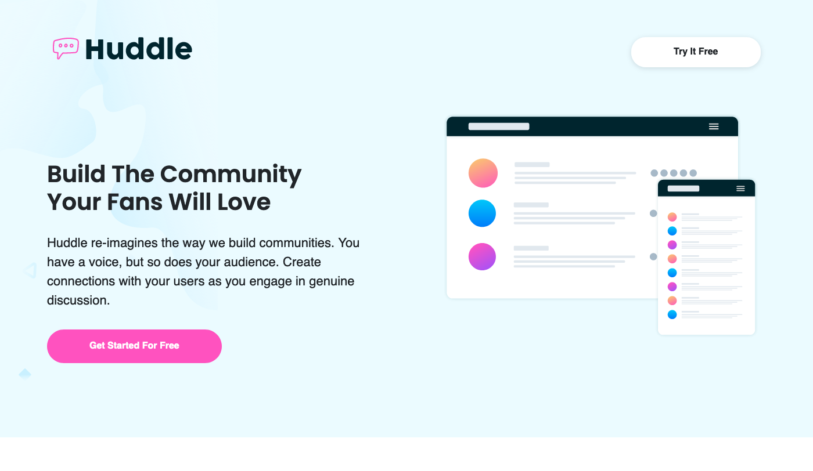

# Frontend Mentor - Huddle Landing Page Solution

This is a solution to the [Huddle landing page with alternating feature blocks challenge on Frontend Mentor](https://www.frontendmentor.io/challenges/huddle-landing-page-with-alternating-feature-blocks-5ca5f5981e82137ec91a5100). Frontend Mentor challenges help you improve your coding skills by building realistic projects. 

## Table of contents

- [Frontend Mentor - Huddle Landing Page Solution](#frontend-mentor---huddle-landing-page-solution)
  - [Table of contents](#table-of-contents)
    - [The challenge](#the-challenge)
    - [Screenshots](#screenshots)
    - [Links](#links)
    - [Built with](#built-with)
  - [Author](#author)

### The challenge

Users should be able to:

- View the optimal layout for the site depending on their device's screen size
- See hover states for all interactive elements on the page

### Screenshots

### Links

- Solution URL: [Github Repo](https://github.com/ayearicks/Huddle-Landing-Page)
- Live Site URL: [Live Site](https://yearicks.dev/Huddle-Landing-Page/index.html)

### Built with

- Semantic HTML5 markup
- Bootstrap 5
- CSS custom properties
- Flexbox
- Mobile-first workflow
- Visual Studio Code
- Firefox Developer Edition

## Author

- Website - [Ashley Yearicks](https://yearicks.dev)
- Twitter - [@jessarin5](https://www.twitter.com/jessarin5)
